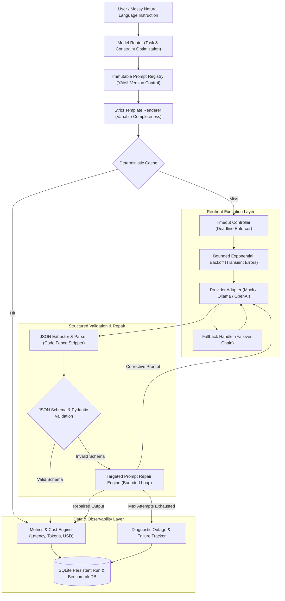

# CLAW PROMPTOPS
### Controlled LLM Generation, Routing & Evaluation Platform
> **Tagline:** *"From messy instructions to reliable structured AI outputs."*

---

## 1. Project Overview
**CLAW PromptOps** is an enterprise-grade LLM operations, routing, and evaluation platform. It bridges the critical reliability gap between messy, unstructured natural language instructions and strict, production-ready structured outputs. 

Unlike basic chatbot wrappers or one-off prompt playgrounds, CLAW PromptOps provides a complete engineering pipeline with provider abstraction, model routing, prompt versioning, JSON Schema validation, automated error repair, bounded retries, failover fallback, caching, live token streaming, side-by-side experiments, and a comprehensive 50-test regression benchmark.

---

## 2. Problem Statement
Production software systems cannot ingest arbitrary, unvalidated text from generative models. In real-world applications:
- Users provide ambiguous, informal, or incomplete requests.
- LLMs frequently hallucinate conversational preambles, omit required fields, wrap outputs in invalid markdown, or emit mismatched types.
- Network glitches and provider rate limits cause sudden outages.
- Upgrading prompt templates without systematic regression benchmarking can silently degrade reliability.

**CLAW PromptOps solves these challenges** through an automated, resilient PromptOps pipeline that guarantees schema compliance, handles transient and permanent failures, and provides verifiable empirical metrics.

---

## 3. Architecture



---

## 4. Features & Capabilities

- **Unified Provider Abstraction:** Seamlessly switch between the offline deterministic `MockAdapter`, local `OllamaAdapter`, and cloud-based `OpenAICompatibleAdapter`.
- **100% Offline / Local-First Development:** Full functionality, automated tests, and interactive UI run out-of-the-box with zero internet access, no API keys, and no external daemons required.
- **Controlled Failure Simulation:** Deterministic simulation of malformed JSON, missing fields, type violations, timeouts, and interrupted streams for dependable demonstrations.
- **Immutable Prompt Registry:** YAML-based versioned prompts (`v1.0`, `v2.0`). Enforces strict immutability—existing versions cannot be modified in place.
- **Strict Variable Validation:** Validates all required template variables before rendering; never silently injects `"None"` into prompts.
- **Two-Tier Structured Validation:** Rust-backed Pydantic v2 validation paired with dynamic JSON Schema Draft-7 verification.
- **Automated Surgical Repair Loop:** When an output violates validation, the system builds an error-correction prompt with exact validation violation bullets and re-prompts the model.
- **Bounded Exponential Backoff Retries:** Automatically recovers from transient network drops and HTTP 503 errors while immediately aborting on permanent errors.
- **Request Timeout Enforcement:** Strict deadlines prevent hung connections.
- **Transparent Fallback Chains:** Automatically switches to secondary models upon primary failure, explicitly recording `fallback_used=True`.
- **Explainable Model Routing:** Deterministic routing based on task, latency, and cost constraints with human-auditable routing explanations on every run.
- **Configuration-Aware Caching:** Parameter-hashed cache incorporating prompt version, temperature, and tokens to eliminate duplicate API costs.
- **50+ Fixed Test Regression Suite:** 50 deterministic edge cases, negative tests, and normal scenarios for reproducible benchmark evaluations.
- **Side-by-Side Prompt & Model Experiments:** Rigorous A/B comparison (`v1` vs `v2`, `Model A` vs `Model B`) over identical test cases.
- **Modern Dark UI Dashboard:** Streamlit dashboard featuring 9 operational pages styled in a professional dark navy/electric blue theme.

---

## 5. Technology Stack

- **Language:** Python 3.11+ / 3.14
- **Web API:** FastAPI & Uvicorn (ASGI)
- **Validation:** Pydantic v2 & JSON Schema (`jsonschema`)
- **Database & ORM:** SQLite with SQLAlchemy 2.0 (Mapped Typing)
- **Frontend Dashboard:** Streamlit
- **Testing:** Pytest & Pytest-Asyncio
- **HTTP Client:** HTTPX (Async/Sync)
- **Containerization:** Docker & Docker Compose

---

## 6. Installation

Clone the repository and set up a Python virtual environment:

```bash
git clone <repo-url> claw-promptops
cd claw-promptops

python3 -m venv .venv
source .venv/bin/activate
pip install -r requirements.txt
```

Verify dependency installation:
```bash
pip check
```

---

## 7. Environment Setup

Copy `.env.example` to `.env`:
```bash
cp .env.example .env
```

Configuration variables available in `.env`:
```ini
# Application & Logging
APP_NAME="CLAW PromptOps"
LOG_LEVEL=INFO

# API Server
API_HOST=127.0.0.1
API_PORT=8000

# Persistence
DATABASE_URL=sqlite:///./claw_promptops.db

# Model Execution Defaults
DEFAULT_MODEL=mock-deterministic
MODEL_TIMEOUT_SECONDS=30
MAX_RETRIES=2
MAX_REPAIR_ATTEMPTS=2
CACHE_ENABLED=true

# Provider Settings
OLLAMA_BASE_URL=http://localhost:11434
OPENAI_BASE_URL=https://api.openai.com/v1
OPENAI_API_KEY=
```

---

## 8. Running the Backend API

Start the FastAPI application with Uvicorn:

```bash
source .venv/bin/activate
uvicorn app.main:app --host 127.0.0.1 --port 8000 --reload
```

Interactive OpenAPI documentation will be available at:
- **Swagger UI:** [http://127.0.0.1:8000/docs](http://127.0.0.1:8000/docs)
- **ReDoc:** [http://127.0.0.1:8000/redoc](http://127.0.0.1:8000/redoc)
- **Health Probe:** [http://127.0.0.1:8000/health](http://127.0.0.1:8000/health)

---

## 9. Running the Streamlit Dashboard

Launch the executive operations dashboard:

```bash
source .venv/bin/activate
streamlit run ui/dashboard.py
```

Open your browser to: [http://localhost:8501](http://localhost:8501)

The dashboard provides 9 navigation views:
1. **Overview:** Executive KPIs, schema validity rate, avg latency, and recent failures.
2. **Generate:** Interactive generation playground with live streaming, repair telemetry, and failure simulation triggers.
3. **Prompt Registry:** Prompt versions, variable requirements, and change history audit logs.
4. **Models:** Capability profiles, context windows, and token pricing rates.
5. **Experiments:** Side-by-side prompt version and model A/B benchmarking.
6. **Test Suite (50+):** Full regression test runner across all 50 fixed scenarios.
7. **Run History:** Filterable historical audit records stored in SQLite.
8. **Failures:** Diagnostic outage and failure log tracking root causes.
9. **Metrics:** Real aggregate system metrics computed directly from database records.

---

## 10. Running Automated Tests

Run the full automated test suite (Unit, Integration, and 50-Case Regression):

```bash
source .venv/bin/activate
pytest -v
```

Run specific test modules:
```bash
# Unit tests
pytest tests/unit/ -v

# Integration tests
pytest tests/integration/ -v

# 50+ fixed regression cases
pytest tests/regression/ -v
```

---

## 11. Running with Local Ollama

To use a real local LLM backend:
1. Install Ollama from [ollama.com](https://ollama.com).
2. Pull your desired model:
   ```bash
   ollama pull llama3
   ollama pull mistral
   ```
3. Start the Ollama daemon:
   ```bash
   ollama serve
   ```
4. In `.env`, ensure `OLLAMA_BASE_URL=http://localhost:11434`.
5. Select `llama3` or `mistral` in the Dashboard or API.

---

## 12. Adding Another Provider

To add a new provider (e.g., Anthropic, Cohere, or custom microservice):
1. Create `app/adapters/my_provider.py` subclassing `BaseModelAdapter`:
   ```python
   from app.adapters.base import BaseModelAdapter, GenerationRequest, GenerationResponse, ModelInfo, StreamChunk

   class MyProviderAdapter(BaseModelAdapter):
       async def generate(self, request: GenerationRequest) -> GenerationResponse:
           # Call provider API
           ...

       async def stream(self, request: GenerationRequest):
           # Stream chunks
           ...

       def supports_structured_output(self) -> bool:
           return True

       def get_model_info(self) -> ModelInfo:
           return ModelInfo(name=self.model_name, provider="my_provider")
   ```
2. Register the adapter in `app/adapters/__init__.py` inside `get_adapter()`.

---

## 13. Adding Prompts & Versions

All prompts are version-controlled YAML files stored in `prompts/<prompt_name>/<version>.yaml`.

Example `prompts/event_brief/v3.0.yaml`:
```yaml
name: "event_brief"
version: "v3.0"
description: "Production v3 with enhanced venue geocoding"
task_type: "event_brief"
output_schema: "schemas/event_brief.json"
variables:
  - name: "instruction"
    description: "Raw user input"
    required: true
model_requirements:
  temperature: 0.0
  max_tokens: 1024
  response_format: "json"
metadata:
  author: "PromptOps Team"
creation_date: "2026-10-03"
change_description: "Added venue coordinate constraints"
template: |
  Extract the event information from the instruction below into JSON:
  {{instruction}}
```

The system automatically discovers and registers new prompt files on startup.

---

## 14. Running Experiments

CLAW PromptOps supports running empirical A/B benchmarks over identical test sets.
- From the **Dashboard**, open the **Experiments** page.
- Select **Prompt Version A** (e.g., `v1.0`), **Prompt Version B** (e.g., `v2.0`), and target models.
- Click **Run Benchmark Experiment**.
- Review side-by-side deltas for schema validity, latency, tokens, cost, and repair rates.

---

## 15. Understanding Metrics

All metrics are calculated strictly from real database records (detailed in `docs/evaluation.md`):
- **Schema Validity Rate:** Percentage of runs conforming strictly to target JSON Schemas.
- **Instruction Following Rate:** Percentage of test case constraints satisfied.
- **Average Latency:** Mean end-to-end roundtrip duration in milliseconds.
- **Cost Estimation:** Calculated using model pricing per 1,000 tokens ($T_{\text{in}} \times P_{\text{in}} + T_{\text{out}} \times P_{\text{out}}$).
- **Repair Rate:** Percentage of generations requiring automated schema error repair.
- **Failure Rate:** Percentage of runs that permanently failed.
- **Cache Hit Rate:** Proportion of requests served from cache.

---

## 16. Troubleshooting

- **Ollama Connection Refused:** Ensure `ollama serve` is running and accessible at `http://localhost:11434`.
- **Database Lock on SQLite:** SQLite supports concurrent reads, but sequential writes. In production environments, set `DATABASE_URL=postgresql://...`.
- **Test Suite Timeout:** If running against real local models, execution speed depends on your local GPU/CPU; default tests run on the instantaneous `MockAdapter`.

---

## 17. Project Structure

```
claw-promptops/
├── app/
│   ├── main.py                  # FastAPI application entry point & CORS
│   ├── config.py                # Environment-backed Pydantic settings & pricing
│   ├── api/
│   │   ├── routes.py            # REST endpoints (/health, /generate, /experiments)
│   │   └── schemas.py           # Pydantic request & response contracts
│   ├── adapters/
│   │   ├── base.py              # BaseModelAdapter abstract interface & contracts
│   │   ├── mock.py              # Deterministic MockAdapter & failure simulator
│   │   ├── ollama.py            # Local Ollama HTTP REST adapter
│   │   └── openai_compatible.py # Cloud & gateway OpenAI-compatible adapter
│   ├── prompts/
│   │   ├── loader.py            # YAML discovery & PromptDefinition loader
│   │   ├── renderer.py          # Strict template variable renderer
│   │   └── registry.py          # Immutable versioned prompt registry
│   ├── routing/
│   │   └── router.py            # Explainable deterministic model router
│   ├── generation/
│   │   ├── generator.py         # Master PromptOps generation coordinator
│   │   ├── retry.py             # Bounded exponential backoff retry engine
│   │   ├── timeout.py           # Strict execution timeout controller
│   │   └── fallback.py          # Automated failover chain handler
│   ├── validation/
│   │   ├── parser.py            # JSON extractor & code fence parser
│   │   ├── json_validator.py    # JSON Schema & Pydantic validation
│   │   └── repair.py            # Targeted corrective prompt repair loop
│   ├── metrics/
│   │   ├── cost.py              # Token pricing calculation
│   │   └── evaluator.py         # Instruction-following semantic checker
│   ├── cache/
│   │   └── cache.py             # Parameter-hashed generation cache
│   ├── database/
│   │   ├── database.py          # SQLAlchemy 2.0 engine & session maker
│   │   ├── models.py            # Runs, Experiments, Failures, TestCases ORM models
│   │   └── repositories.py      # Data-access repositories & aggregate analytics
│   └── experiments/
│       ├── comparison.py        # Side-by-side metric delta calculator
│       └── runner.py            # A/B benchmark execution engine
├── prompts/                     # Versioned prompt YAML storage
│   ├── event_brief/
│   │   ├── v1.yaml
│   │   └── v2.yaml
│   └── content_pack/
│       ├── v1.yaml
│       └── v2.yaml
├── schemas/                     # Formal JSON Schema specifications
│   ├── event_brief.json
│   └── content_pack.json
├── evaluation/
│   ├── test_cases.json          # 50 fixed reproducible test cases
│   └── runner.py                # Evaluation benchmark suite runner
├── tests/
│   ├── unit/                    # Unit tests for adapters, registry, parser, health
│   ├── integration/             # Integration tests for end-to-end pipeline & API
│   └── regression/              # Regression tests for 50+ fixed test suite
├── ui/
│   └── dashboard.py             # Streamlit 9-page executive operations dashboard
├── docs/
│   ├── architecture.md          # Detailed architecture specification with Mermaid diagrams
│   ├── design_decisions.md      # Foundational engineering rationale
│   ├── evaluation.md            # Mathematical definitions of all metrics
│   └── failure_log.md           # Record of genuine development failures & fixes
├── README.md                    # Project documentation
├── AI_USAGE.md                  # Attribution and AI usage verification
├── PROJECT_STATUS.md            # Component and test status tracker
├── requirements.txt             # Verified Python dependencies
├── .env.example                 # Environment template
├── .gitignore                   # Ignore rules for secrets, DBs, and venv
├── Dockerfile                   # Multi-stage container build
└── docker-compose.yml           # Coordinated API and Dashboard deployment
```
