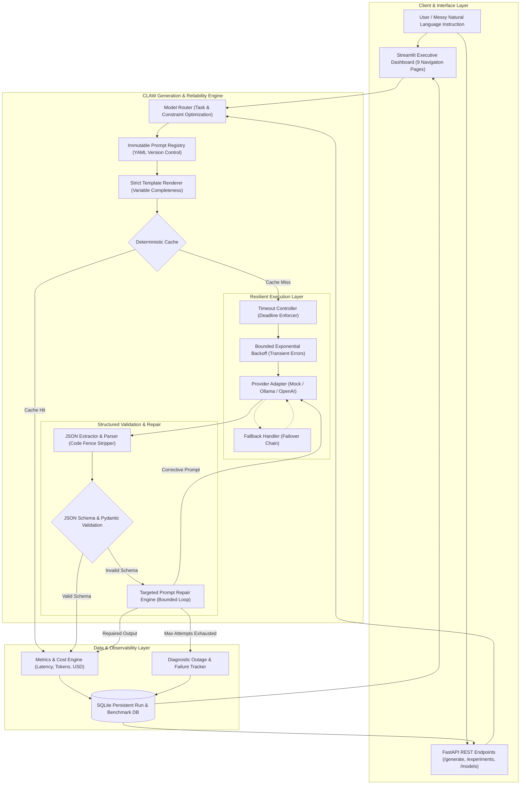

# CLAW PROMPTOPS - Comprehensive System Architecture Specification

## 1. Executive Summary & Purpose
CLAW PromptOps (**Controlled LLM Generation, Routing & Evaluation Platform**) is an industrial-grade PromptOps engineering system designed to transition AI systems away from unmonitored chatbots into deterministic, verifiable software components.

The platform provides a complete lifecycle for converting ambiguous natural-language instructions into validated, schema-compliant structured data with automatic repair, retry, fallback, caching, explainable routing, and reproducible benchmarking.

---

## 2. End-to-End System Architecture



---

## 3. Subsystem Breakdown

### 3.1. Provider Abstraction Subsystem (`app/adapters/`)
- **`BaseModelAdapter`**: Abstract base class declaring the unified LLM contract (`generate`, `stream`, `supports_structured_output`, `get_model_info`).
- **`MockAdapter`**: Deterministic, zero-dependency engine enabling 100% offline development, testing, and continuous integration without API keys or external daemons. Emulates controlled failure scenarios (`MOCK_MALFORMED_JSON`, `MOCK_MISSING_FIELD`, `MOCK_WRONG_TYPE`, `MOCK_TIMEOUT`, `MOCK_INTERRUPTED_STREAM`, `MOCK_PROVIDER_ERROR`).
- **`OllamaAdapter`**: Integrates with local Ollama daemons (`/api/generate`) for on-premise privacy-preserving inference.
- **`OpenAICompatibleAdapter`**: Interoperable client for OpenAI, vLLM, Groq, or any gateway implementing standard `/chat/completions`.

### 3.2. Prompt Registry & Versioning Subsystem (`app/prompts/`)
- **Immutability Enforcement:** Once registered, a prompt version (e.g. `v1.0`) is read-only. Updates require publishing an explicit incremented version (`v1.1`, `v2.0`).
- **Strict Variable Validation:** Missing template variables raise explicit exceptions; "None" is never silently inserted into prompt templates.
- **Change History:** Tracks chronological audit notes explaining why prompt changes were introduced.

### 3.3. Validation & Repair Subsystem (`app/validation/`)
- **Robust JSON Extraction:** Strips conversational filler, extracts code blocks from markdown fences (````json ... ````), and handles edge-case wrappers.
- **Two-Tier Validation:** Combines high-speed Rust-backed Pydantic v2 validation for internal models with dynamic JSON Schema Draft-7 evaluation for custom user tasks.
- **Bounded Repair Loop:** When an output fails validation, the system generates a surgical error-correction prompt containing previous erroneous output and exact validation violation bullets. If repairs do not succeed within `MAX_REPAIR_ATTEMPTS`, the run is logged as `FAILED`.

### 3.4. Resilient Execution Subsystem (`app/generation/`)
- **Retry Mechanism:** Differentiates between transient infrastructure errors (HTTP 503, network drop, timeout) and permanent errors (malformed schema, auth error). Applies exponential backoff up to `MAX_RETRIES`.
- **Timeout Controller:** Enforces hard execution deadlines per query (`MODEL_TIMEOUT_SECONDS`), preventing worker thread starvation.
- **Fallback Chain:** Automatically transitions failed primary queries to pre-configured secondary or offline models, recording `fallback_used=True` for auditing.

### 3.5. Model Router (`app/routing/`)
- **Explainable Routing:** Deterministically evaluates task complexity, required latency, and budget to select the optimal model. Every generation records `selected_model` and `routing_reason` for transparent auditing.

### 3.6. Caching Layer (`app/cache/`)
- **Parameter Hashing:** Cache keys are calculated using SHA-256 hashes of `(Task Type, Prompt Name, Prompt Version, Rendered Prompt, Model, Temperature, Max Tokens, Response Format)`. Prevents cross-version contamination and records exact cache hit/miss rates.

### 3.7. Observability, Database & Benchmarking (`app/database/`, `app/metrics/`, `evaluation/`)
- **SQLite + SQLAlchemy 2.0:** Preserves full audit trails for generation runs, benchmark experiments, test case definitions, and failure events.
- **50+ Fixed Test Regression Suite:** Verifies normal, malformed, missing field, wrong type, contradictory, long input, empty input, timeout, stream interruption, and edge scenarios without runtime test hallucination.
- **Side-by-Side Experiments:** Executes identical test sets across prompt versions (`v1` vs `v2`) or models (`Model A` vs `Model B`) to present transparent, measured operational deltas.
